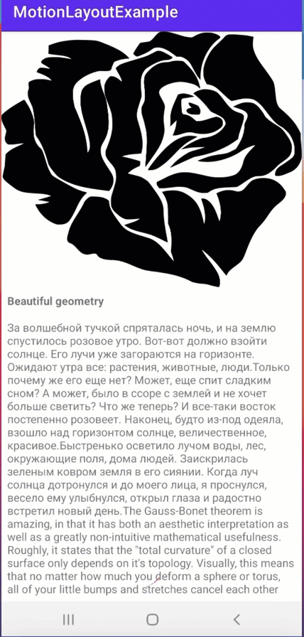

# MotionLayoutExample
motion layout

Demonstration of motion layout
Used 3 key attr:
1. alpha for image view on two steps (50 and 100)
2. scaleX on 100 to shrink view by X
3. scaley on 100 to shrink view by Y

On swipe action with anchor on bottom

Simple Demo

